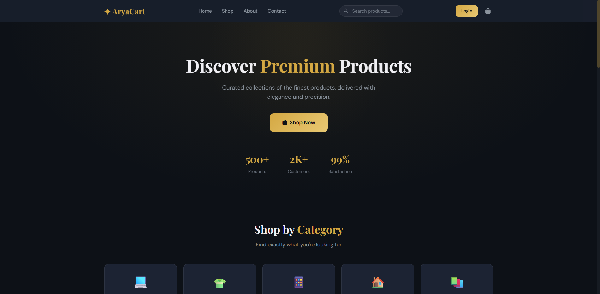
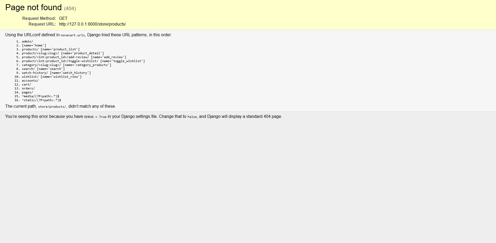
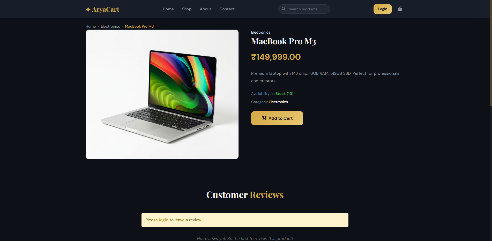
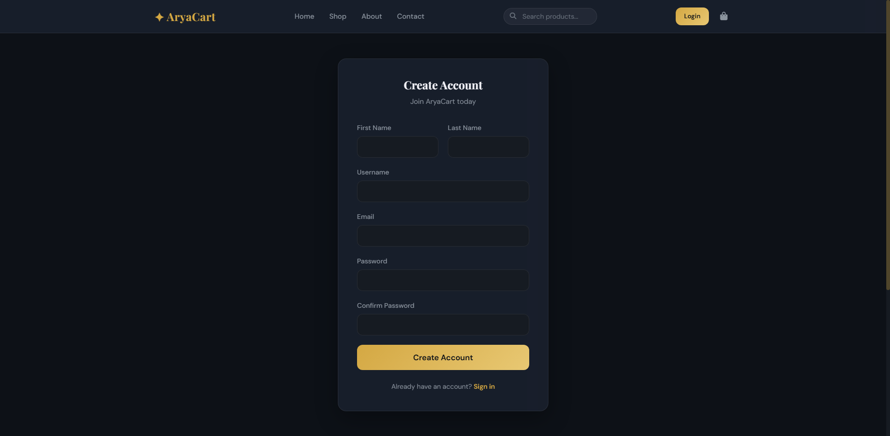
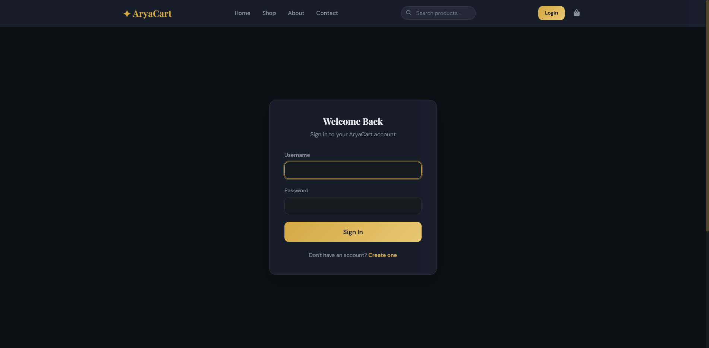
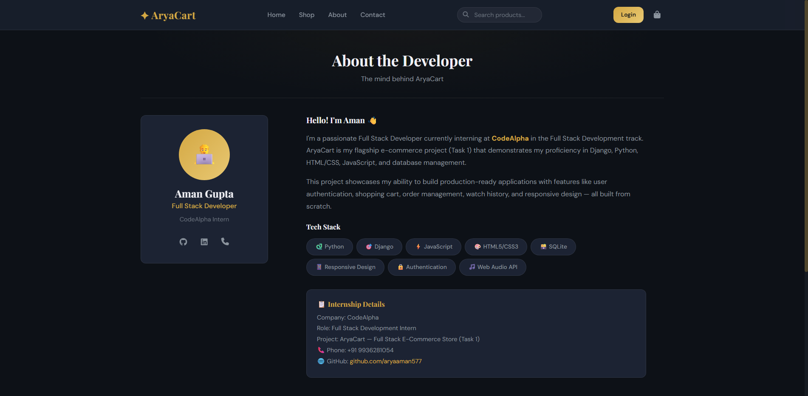
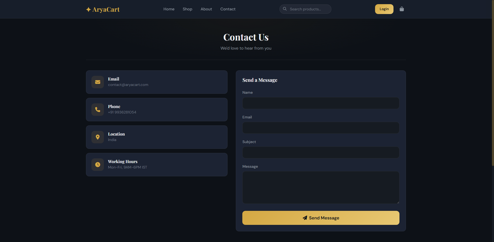
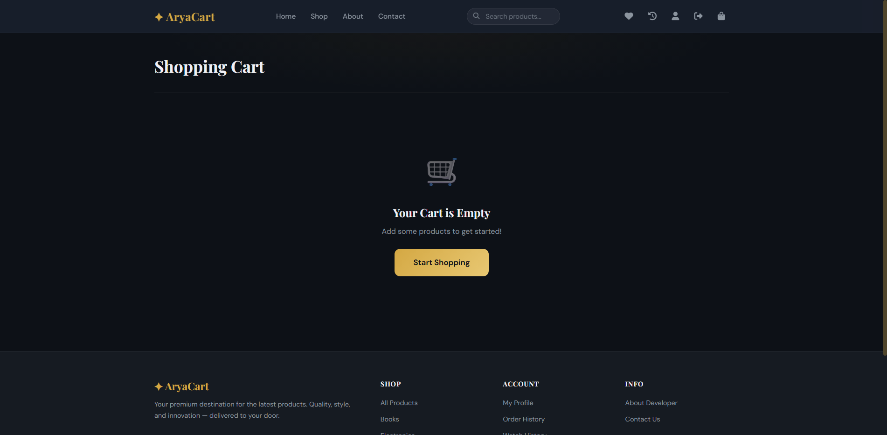
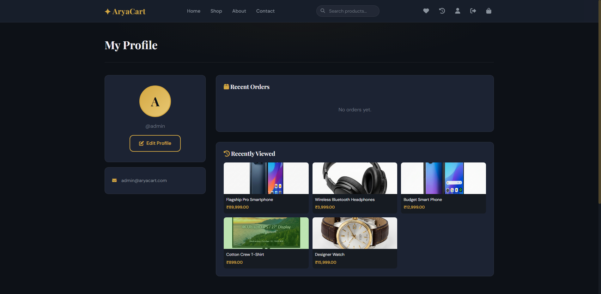
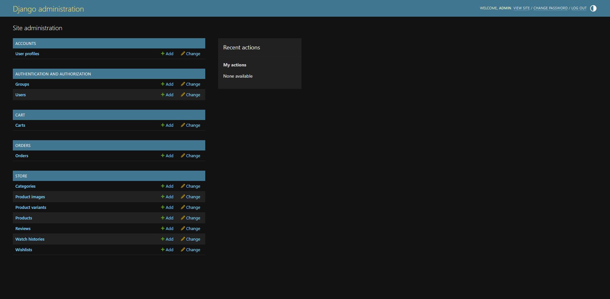

# 🎓 CodeAlpha Internship — Full Stack Web Development

<div align="center">


### 🌐 [Click Here to View Live Website (AryaCart)](https://aryaaman577.pythonanywhere.com)

</div>

---

## 👨‍💻 Candidate Information

| Field | Details |
|---|---|
| **Name** | Aman Gupta |
| **Phone** | +91 9936281054 |
| **Internship** | CodeAlpha — Full Stack Web Development |
| **Duration** | June 2026 |
| **GitHub** | [github.com/aryaaman577](https://github.com/aryaaman577) |

---

## 📋 Task List

| # | Task | Project Name | Status | Tech Stack |
|---|---|---|---|---|
| 1 | E-Commerce Website | **AryaCart** | ✅ Completed | Django, Python, HTML/CSS, JavaScript, SQLite |

---

## 🛒 Task 1: AryaCart — Full Stack E-Commerce Store

### Project Overview

**AryaCart** is a fully functional, production-ready e-commerce web application built from scratch using **Django**. It provides a complete online shopping experience with user authentication, product catalog, shopping cart, order processing, and payment simulation — all wrapped in a premium dark-themed UI.

### ✨ Features Implemented

| Category | Features |
|---|---|
| **🏠 Home Page** | Featured products, latest arrivals, category showcase, dynamic animations |
| **📦 Product Catalog** | Browse all products, filter by category/price, sort by name/price/date |
| **🔍 Search** | Search products by name or description with instant results |
| **🛒 Shopping Cart** | Add/remove items, update quantities, real-time total calculation |
| **👤 User Registration** | Email-based signup with profile creation |
| **🔐 User Login** | Secure authentication with session management |
| **📝 User Profiles** | View/edit profile information, profile picture |
| **📦 Order Processing** | Checkout flow, order placement, order confirmation |
| **📜 Order History** | View past orders with status tracking |
| **💳 Payment Simulation** | Realistic payment UI (Card/UPI/Net Banking) |
| **💰 Coupon System** | Apply discount codes at checkout |
| **❤️ Wishlist** | Save favorite products for later |
| **👁️ Watch History** | Track recently viewed products |
| **⭐ Product Reviews** | Rate and review products (1-5 stars) |
| **📂 Categories** | Organized product categories (Electronics, Fashion, etc.) |
| **🖼️ Product Images** | Unique images for all 40 products |
| **📱 Responsive Design** | Mobile-friendly layout across all pages |
| **🎨 Premium UI** | Dark theme with gold accents, glassmorphism, micro-animations |
| **🔐 Admin Panel** | Full Django admin for managing all store data |
| **📧 Email Notifications** | Order confirmation emails (console-simulated) |

### 🛠️ Technologies Used

| Technology | Purpose |
|---|---|
| **Python 3.10+** | Backend programming language |
| **Django 4.2+** | Web framework |
| **SQLite** | Database (development) |
| **HTML5** | Page structure |
| **CSS3** | Styling with custom design system |
| **JavaScript (ES6+)** | Frontend interactivity |
| **Pillow** | Image processing |
| **Font Awesome** | Icons |
| **Google Fonts** | Typography (Playfair Display, DM Sans) |

### 📁 Repository Structure

```
codealpha_tasks/
├── README.md                          ← You are here
└── Task1_AryaCart/
    ├── README.md                      ← Detailed project documentation
    ├── requirements.txt               ← Python dependencies
    ├── manage.py                      ← Django management script
    ├── Procfile                       ← Production server config
    ├── render.yaml                    ← Render deployment blueprint
    ├── build.sh                       ← Build script for deployment
    ├── novacart/                      ← Django project settings
    │   ├── settings.py
    │   ├── urls.py
    │   └── wsgi.py
    ├── store/                         ← Product catalog, categories, search
    ├── accounts/                      ← User registration, login, profiles
    ├── cart/                          ← Shopping cart functionality
    ├── orders/                        ← Checkout & order management
    ├── pages/                         ← Static pages (about, contact)
    ├── templates/                     ← HTML templates
    ├── static/                        ← CSS, JS, images
    └── media/                         ← Product images
```

### 🚀 How to Run the Project

```bash
# 1. Clone the repository
git clone https://github.com/aryaaman577/codealpha_tasks.git
cd codealpha_tasks/Task1_AryaCart

# 2. Create a virtual environment
python -m venv venv
venv\Scripts\activate         # Windows
# source venv/bin/activate    # macOS/Linux

# 3. Install dependencies
pip install -r requirements.txt

# 4. Run database migrations
python manage.py migrate

# 5. Create admin account
python manage.py createsuperuser

# 6. Start the development server
python manage.py runserver

# 7. Open in browser
# Visit: http://127.0.0.1:8000
# Admin: http://127.0.0.1:8000/admin
```

### 📸 Screenshots

| Page | Preview |
|---|---|
| **01. Home Page** |  |
| **02. Shop Page** |  |
| **03. Product Detail** |  |
| **04. Register Page** |  |
| **05. Login Page** |  |
| **06. About Page** |  |
| **07. Contact Page** |  |
| **08. Cart Page** |  |
| **09. Profile Page** |  |
| **10. Admin Panel** |  |

### 🗄️ Database Schema

| Model | Fields | Purpose |
|---|---|---|
| **Category** | name, slug, image, description | Product categories |
| **Product** | name, price, description, image, category, stock | Product listings |
| **User** | username, email, password (Django built-in) | User accounts |
| **Profile** | user, phone, address, city, state, pincode | Extended user info |
| **Cart** | user, coupon | Shopping cart |
| **CartItem** | cart, product, quantity | Items in cart |
| **Order** | user, total, status, address, payment info | Order records |
| **OrderItem** | order, product, quantity, price | Items in order |
| **Review** | user, product, rating, comment | Product reviews |
| **Wishlist** | user, product | Saved items |
| **WatchHistory** | user, product, timestamp | Browsing history |
| **Coupon** | code, discount_percentage, valid dates | Discount codes |

---

## 📚 Learning Outcomes

Through this internship, I gained hands-on experience in:

1. **Full Stack Development** — Building complete web applications from frontend to backend
2. **Django Framework** — Models, Views, Templates, URL routing, ORM, Admin
3. **Database Design** — Relational modeling with SQLite, migrations, queries
4. **User Authentication** — Registration, login, session management, profiles
5. **E-Commerce Logic** — Cart management, checkout flow, order processing, payment handling
6. **Frontend Design** — Responsive CSS, dark themes, micro-animations, glassmorphism
7. **JavaScript** — DOM manipulation, AJAX, toast notifications, dynamic UI
8. **Deployment** — Production configuration for Render and PythonAnywhere
9. **Version Control** — Git workflow, GitHub repository management
10. **Project Architecture** — Clean code organization, reusable components, separation of concerns

---

## 🔗 Links

| Resource | URL |
|---|---|
| **Live Demo** | [AryaCart on PythonAnywhere](https://aryaaman577.pythonanywhere.com) |
| **GitHub (AryaCart)** | [github.com/aryaaman577/AryaCart](https://github.com/aryaaman577/AryaCart) |
| **GitHub (Tasks)** | [github.com/aryaaman577/codealpha_tasks](https://github.com/aryaaman577/codealpha_tasks) |

---

<div align="center">

Made with ❤️ by **Aman Gupta** | CodeAlpha Internship 2026

📞 +91 9936281054 | 🐙 [GitHub](https://github.com/aryaaman577)

</div>
